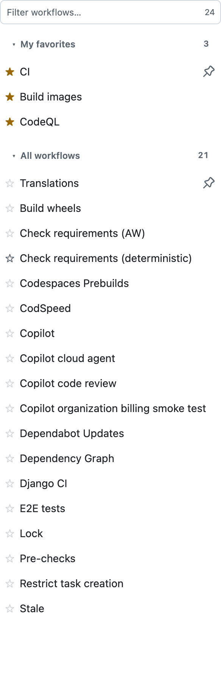
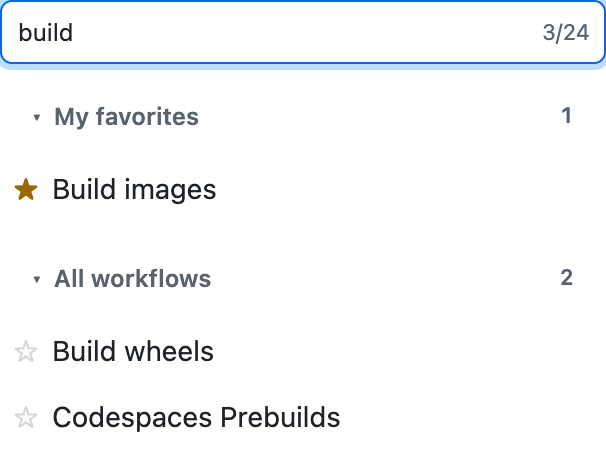
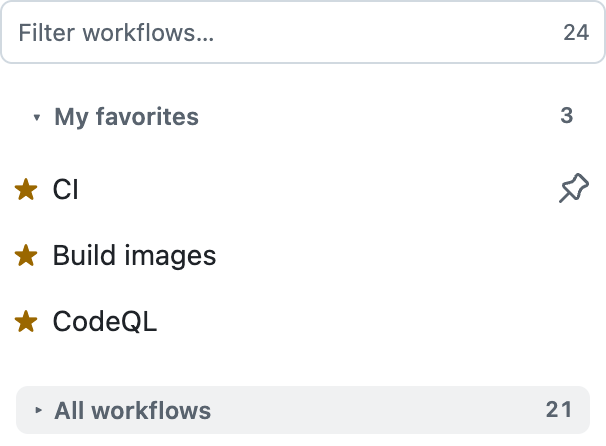

# GitHub Actions: Pins & Filter

A Firefox and Chrome extension. It adds three things to the GitHub Actions sidebar:

1. **Private favorites.** Star any workflow to lift it into a **My favorites** group at the top of
   the sidebar. The star is yours alone. GitHub's own pin is repository-wide, needs write access,
   and caps you at 5. This one is per-user, needs no permissions on the repository, and has no limit.
2. **Two collapsible groups.** **My favorites**, then **All workflows**, each under a header you
   can click to roll up. The headers reuse GitHub's own section-divider styling. With nothing
   favorited there is one flat list and no headers at all, because a lone header labels nothing.
3. **A live filter over every workflow.** Type to narrow the list. Terms match in any order, against
   both the workflow name and its filename.

<p align="center">
  
</p>

GitHub paginates the sidebar and renders only the first page, so a plain filter would search ten
workflows out of a hundred. On load this extension pulls the remaining pages from the same
`/{owner}/{repo}/actions/workflows_partial` endpoint that GitHub's own "Show more workflows" button
uses, then hides that button. The filter therefore searches everything.

Every page is fetched at once rather than one after another, so the cost is one round trip instead
of one per page. Favorites do not wait for any of it: the extension caches each workflow's display
name, draws the favorites group from that cache immediately, and swaps in the real rows when they
arrive.

### Firefox: grant access to github.com

Access to github.com is an optional permission, and Firefox does not grant it at install. Until you
do, the extension cannot fetch the rest of the workflow list itself.

Open the options page and press **Grant access to github.com**. The section disappears once it is
granted. `about:addons` → this extension → **Permissions** works too.

Without it nothing breaks: favorites still draw from cache and stay on screen, the headers stay,
and the extension falls back to clicking GitHub's own "Show more workflows" button, which runs in
the page and needs no permission from you. It is just slower, one page per click.

## Your favorites are not deleted by accident

A favorite whose workflow no longer exists is dropped from the sidebar. Dropping one is not
something you asked for, so every doubt resolves in favour of keeping it. A favorite is only ever
dropped when all of these hold:

- every page of the workflow list loaded without a single failed request
- the sidebar rendered at least one workflow
- the change would not remove every favorite at once

Each of those states is indistinguishable from "the repository really did delete them", and each
is far more likely to mean a failed request, an expired session, or a half-rendered page.

Whatever is dropped is kept. The options page lists it under **Removed automatically**, with the
workflow name and the date, and a **Restore** button that puts it back.

### Upgrading over existing favorites

Favorites are safe across updates. Every released version has stored them the same way, as
`pins:<owner>/<repo>` holding an ordered array of workflow ids, and nothing has ever rewritten that
shape. Later versions added `__collapsed`, `names:` and `removed:` as separate local keys, so they
add to your data rather than reinterpret it. A `pins:` value that is not an array reads as empty
instead of throwing. Tests cover reading favorites written by an earlier version, including ids
with a path segment such as `agents/copilot-pull-request-reviewer`.

Export from the options page first if you want a copy regardless.

## Install for development

### Firefox

1. Open `about:debugging#/runtime/this-firefox`.
2. Click **Load Temporary Add-on**.
3. Pick `manifest.json` in this directory.

A temporary add-on is removed when Firefox restarts. For a permanent install, sign the zip from
`npm run package` at [addons.mozilla.org](https://addons.mozilla.org/developers/) and install the
signed `.xpi`.

### Chrome

1. Open `chrome://extensions`.
2. Turn on **Developer mode**.
3. Click **Load unpacked** and pick this directory.

## Use

- Open any repository's **Actions** tab.
- Hover a workflow. Click the star at the right of the row.
- Favorites move to the **My favorites** group, in the order you starred them.
- Click a group header to roll that group up. The choice sticks, per browser.
- Type in **Filter workflows…** to narrow the list. `Escape` clears it. The counter reads
  `12/87` while filtering, and `87` when not. Each header carries its own match count.
- While you are filtering, a rolled-up group opens on its own. A search that hides its results
  is not a search.

<table>
  <tr>
    <td width="50%" valign="top" align="center">
      
      <br><em>Filtering. The box counts <code>3/24</code>, and each header counts its own matches.</em>
    </td>
    <td width="50%" valign="top" align="center">
      
      <br><em>All workflows rolled up, leaving the three favorites.</em>
    </td>
  </tr>
</table>
- Click the toolbar icon for the current repository's pins.
- **Manage** in that popup opens the options page: sync on or off, export, import, clear.

## Where pins live

Pins default to `storage.sync`, so they follow your browser profile across machines through Firefox
Sync or Chrome Sync. Turn sync off in the options page to keep them on one machine. Switching moves
the pins you already have.

If the sync area ever rejects a write, the pin goes to local storage instead and is still read back.
A sync outage never loses a pin.

Pins are keyed by `owner/repo` and store the workflow filename, for example
`pins:acme/widgets -> ["ci.yaml", "e2e-simple-call.yaml"]`.

## Permissions

- `storage` — to keep your favorites.
- `activeTab` — so the popup can tell which repository you are looking at.
- `https://github.com/*` — so the content script can read the remaining pages of the workflow list
  from GitHub's own partial endpoint.

There is no background script. The extension talks to nothing but github.com and sends nothing
anywhere.

The content script matches all of `https://github.com/*` rather than the Actions URL alone. GitHub
navigates with Turbo, so a narrower match never injects when you reach Actions by clicking the tab
from another page: the document never reloads. On every page that is not an Actions sidebar the
script returns immediately and touches nothing.

## Publishing

`STORE-LISTING.md` holds the listing copy, the permission justifications, the data disclosures and
a submission checklist. `PRIVACY.md` is the privacy policy; both stores need it at a public URL.
`store/` holds the assets at the exact sizes Chrome requires.

Two things to settle before the first public build:

1. **The name.** `GitHub Actions: Pins & Filter` leads with someone else's trademark and reads like
   a GitHub product. See `STORE-LISTING.md`.
2. **`browser_specific_settings.gecko.id`.** Storage is keyed to it. Change it after release and
   every user's favorites vanish.

## Develop

```bash
npm test              # unit tests, no dependencies, uses node:test
npm run icons         # redraw icons/*.png with the standard library
npm run package       # build dist/*.zip for both stores
npm run lint:firefox  # web-ext lint, downloads web-ext on demand
npm run verify:pagination   # walk the live partial endpoint, page by page
npm run verify:sidebar      # 22 DOM checks in a real browser, exits non-zero on failure
npm run screenshot          # retake docs/ and store/ images from a real browser
```

Unit tests and lint run on every push. The browser checks run nightly, because they drive a real
browser against live github.com. See `CONTRIBUTING.md` before writing one.

`npm run screenshot` needs Playwright's own Chromium:

```bash
npm i -D playwright && npx playwright install chromium
```

Use that build, not the installed Google Chrome. Chrome 137 and later ignore `--load-extension`,
so an extension never loads there and every check silently reports nothing.

### Layout

| File             | Role                                                              |
| ---------------- | ----------------------------------------------------------------- |
| `src/api.js`     | Picks `browser` or `chrome`, whichever the browser provides.       |
| `src/store.js`   | Pin storage. Takes the browser API as an argument, so it is testable. |
| `src/match.js`   | Filter matching and pin ordering. Pure functions.                  |
| `src/content.js` | The sidebar DOM work: stars, ordering, filter box.                 |
| `src/popup.*`    | Toolbar popup for the current repository.                          |
| `src/options.*`  | Sync toggle, export, import, clear, full pin list.                 |

`store.js` and `match.js` hold the logic and have unit tests. `content.js` holds the DOM work,
which unit tests cannot reach, so `npm run verify:sidebar` checks it in a real browser: every page
loaded, no star overlapping a GitHub icon, both headers present after a no-op render, after
filtering, after collapsing and after a reload, and no cached placeholder rows left behind.

Write those checks so they fail against the bug they describe. An early version poked
`document.body` to force a re-render, but the observer only watches the sidebar, so no render ever
happened and all 12 checks passed against a build with a real header bug in it.

### How it survives GitHub redesigns

`content.js` never matches on GitHub's CSS class names, which change often. It finds workflow links
by `href`, then treats whichever element holds the most of them as the sidebar list. If GitHub
changes the markup, revisit these three functions in order:

| Function             | Depends on                                                                  |
| -------------------- | --------------------------------------------------------------------------- |
| `findList()`         | Nothing but `href`. Should outlast most redesigns.                            |
| `loadAllWorkflows()` | The `src` and `data-current-page` attributes on GitHub's show-more element.   |
| `placeStar()`        | The class names GitHub gives a row's trailing badge, to avoid drawing over it. |

Run `npm run verify:pagination` to check `loadAllWorkflows()`'s page walk against the live
endpoint. It reports how many workflows each page returns and where the walk stops.

### What this extension does not touch

GitHub's own repository-wide pins are left exactly as GitHub renders them. The extension neither
groups them nor changes them. They are someone else's choice and can change at any time, so the
only list it manages is the one you curate. Where GitHub draws its own badge at the right of a
row, `placeStar()` steps the star inwards so the two never overlap.
